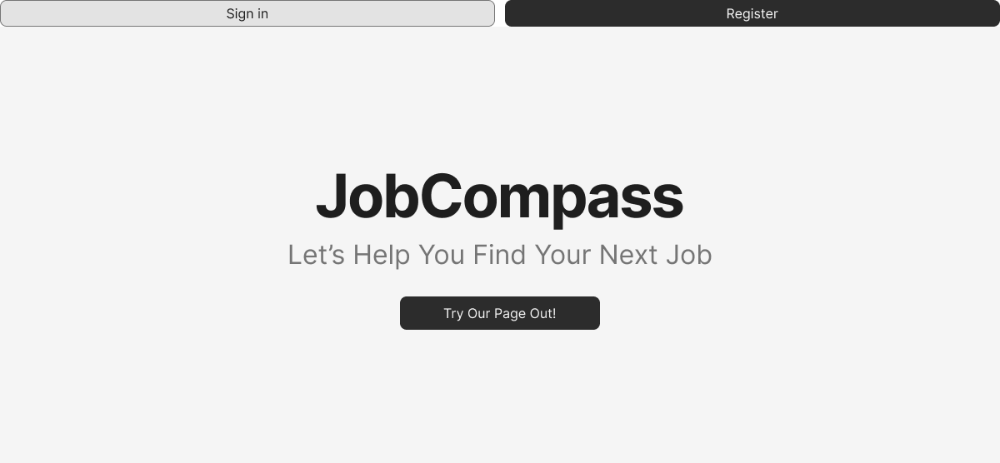
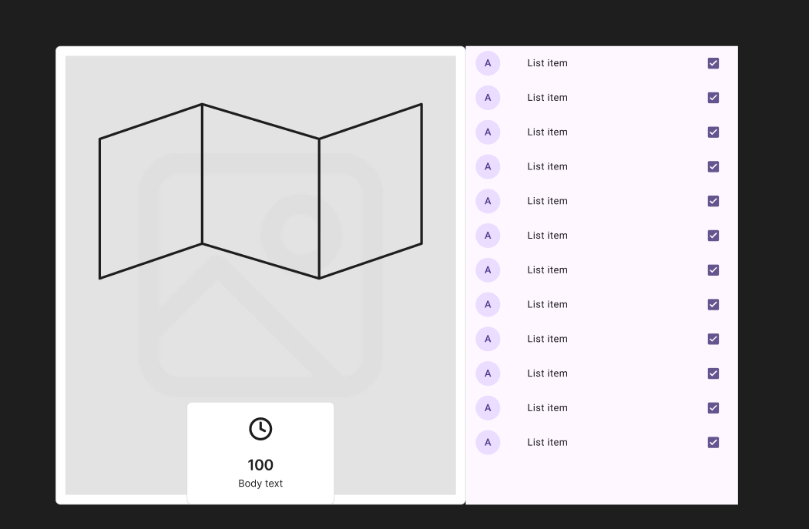
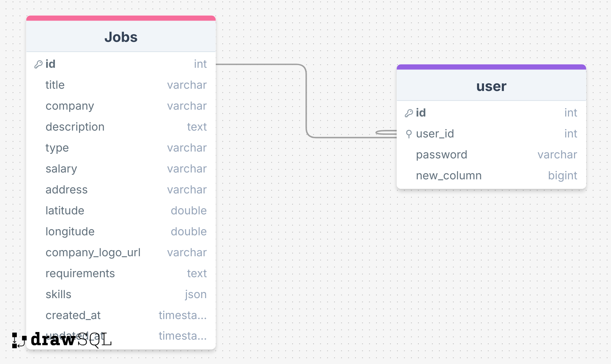

# Project Title

JobCompass

## Overview

What is your app? Give a brief description in a couple of sentences.

Job Compass is an interactive map that pinpoints locations of jobs depending on the type of job (part time, full time, contract) with a
dataset that refreshes the highlighed jobs in map to show different jobs. Think Rent Faster meets Indeed.

### Problem Space

Why is your app needed? Give any background information around any pain points or other reasons.

Indeed and Linkedin lack the interactivity that comes in job hunting - the monotony and automation may get to people who are going through
stressful times. The goal with JobCompass is to provide a bit of randomness in terms of jobs refreshing (depending on what job the user is looking
for) and a bit of fun in terms of physically seeing where they'll work so they don't have to do the extra work of finding the company on
Google Maps.

### User Profile

Who will use your app? How will they use it? Add any special considerations that your app must take into account.

Primarily users will use my app through the ability to log in, save their favorite jobs, and apply for work. A later feature for recruiters would be added if time
permits (as another feature of the app might be the job swipe option, similar to Tinder but for work, with each user having three swipes a day)

### Features

List the functionality that your app will include. These can be written as user stories or descriptions with related details. Do not describe _how_ these features are implemented, only _what_ needs to be implemented.

MVP:

- As a guest, I want to be able to view the interactive map and view jobs (and have map include job markers)

- As a guest, I want to be able to create an account to manage my job applications (now user)
- As a guest, I want to be able to login to my account to manage my job applications (now user)
  \_Manage includes saving jobs, adding notes to saved jobs, deleting saved jobs

STRETCH GOALS:

- As a user, I want to be able to apply for a job with a resume attachment.
- As a user, I want to be able to filter jobs on job type (FT, PT, Casual), and search for specific jobs
- Recruiter register/login/post jobs functionality/view submitted resumes

## Implementation

### Tech Stack

List technologies that will be used in your app, including any libraries to save time or provide more functionality. Be sure to research any potential limitations.

- React
- TypeScript (maybe)
- MySQL / Knex
- Express/Node JS
- Client libraries:
  - react
  - react-router
  - axios
- Server libraries:
  - Knex
  - Express
  - Maybe bcrypt if time permits

### APIs

List any external sources of data that will be used in your app.

- Google Maps API

### Sitemap

List the pages of your app with brief descriptions. You can show this visually, or write it out.

- Home Page
- Map Page with nav bar for searching work + places (disabled for now, sticking with Calgary only)
- Login/Register
- Multi-sectioned page which will have search bar with jobs below it on one side, map on the other, covering the site (mobile will not have map option due to lack of size)

### Mockups

Provide visuals of your app's screens. You can use pictures of hand-drawn sketches, or wireframing tools like Figma.

#### HomePage



### Map Page



### JobCardList Page (for Mobile)

.png>)

### Data

Describe your data and the relationships between the data points. You can show this visually using diagrams, or write it out.



### Endpoints

List endpoints that your server will implement, including HTTP methods, parameters, and example responses.
HAVE MVP ENDPOINTS AND FUTURE ENDPOINTS
Split every section into MVP and Future

**GET /jobs**

- Get list of all jobs for now and list it as a generic board \*(eventually add with map implementation)
  Response:

```
{
[
    title: "Frontend Developer",
    company: "Calgary Tech Solutions",
    description: `Calgary Tech Solutions is a leading digital agency building innovative web applications for businesses across Alberta. We combine technical excellence with creative design to deliver exceptional user experiences.

As our Frontend Developer, you'll build responsive web applications using React and modern JavaScript frameworks. You'll transform design mockups into fully functional interfaces, optimize application performance, and ensure cross-browser compatibility. Working in an agile environment, you'll collaborate with designers, backend developers, and product managers to create seamless user experiences.

This role offers opportunities to mentor junior developers, contribute to our component library, and stay at the forefront of frontend technologies. We encourage continuous learning and provide support for professional development.`,
    type: "Full-time",
    salary_range: "$75,000 - $95,000",
    address: "707 5th Street SW",
    latitude: 51.0486,
    longitude: -114.0708,
    requirements: "3+ years experience with React",
    skills: JSON.stringify(["React", "JavaScript", "HTML/CSS", "Git"]),
]
}
```

**_GET jobs/:id _**

- Get job by id which will show individual job card to the right side (keeping the map implementation anyways);

Response:

```
[
    title: "Frontend Developer",
    company: "Calgary Tech Solutions",
    description: `Calgary Tech Solutions is a leading digital agency building innovative web applications for businesses across Alberta. We combine technical excellence with creative design to deliver exceptional user experiences.

As our Frontend Developer, you'll build responsive web applications using React and modern JavaScript frameworks. You'll transform design mockups into fully functional interfaces, optimize application performance, and ensure cross-browser compatibility. Working in an agile environment, you'll collaborate with designers, backend developers, and product managers to create seamless user experiences.

This role offers opportunities to mentor junior developers, contribute to our component library, and stay at the forefront of frontend technologies. We encourage continuous learning and provide support for professional development.`,
    type: "Full-time",
    salary_range: "$75,000 - $95,000",
    address: "707 5th Street SW",
    latitude: 51.0486,
    longitude: -114.0708,
    requirements: "3+ years experience with React",
    skills: JSON.stringify(["React", "JavaScript", "HTML/CSS", "Git"]),
]
```

**POST /users/register**

- Add a user account

Parameters:

- email: User's email
- password: User's provided password

Response:

```
{
    "token": "seyJhbGciOiJIUzI1NiIsInR5cCI6IkpXVCJ9.eyJzdWIiOiIxMjM0NTY3ODkwIiwibmFtZSI6I..."
}
```

**POST /users/login**

- Login a user

Parameters:

- email: User's email
- password: User's provided password

Response:

```
{
    "token": "seyJhbGciOiJIUzI1NiIsInR5cCI6IkpXVCJ9.eyJzdWIiOiIxMjM0NTY3ODkwIiwibmFtZSI6I..."
}
```

SAVED JOB with maybe delete (add delete and maybe add notes to the job)
if time permits CRUD with recruiter login (post delete update jobs)

STRETCH GOALS:

**_GET users/:id/savedJobs/:id_**

- Includes option to update job (notes) and delete saveed jobs

## Roadmap

Scope your project as a sprint. Break down the tasks that will need to be completed and map out timeframes for implementation working back from the capstone due date.

- Create client

  - react project with routes and boilerplate pages

- Create server

  - express project with routing, with placeholder 200 responses

- Fetch Map API

  - Fetch Google Maps APi and render it on screen with markers of jobs on maps that eventually will disappear after a while/be replaced with
    other jobs

- Create seed for DB

- Feature: combine maps with list of cards

- Feature: Home Page + User Login/Register Page

- Feature: Create account

  - Implement register page + form
  - Create POST /users/register endpoint

- Feature: Login

  - Implement login page + form
  - Create POST /users/login endpoint

- Feature: Implement JWT tokens
  - Server: Update expected requests / responses on protected endpoints
  - Client: Store JWT in local storage, include JWT on axios calls

## Future Implementations

Your project will be marked based on what you committed to in the above document. Here, you can list any additional features you may complete after the MVP of your application is built, or if you have extra time before the Capstone due date.

- Recruiter sign up + Post jobs
- User can apply for job
